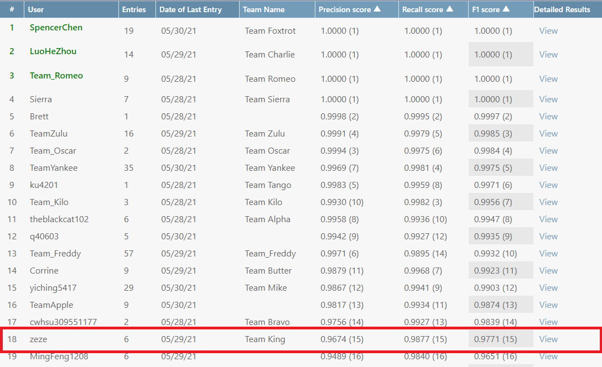
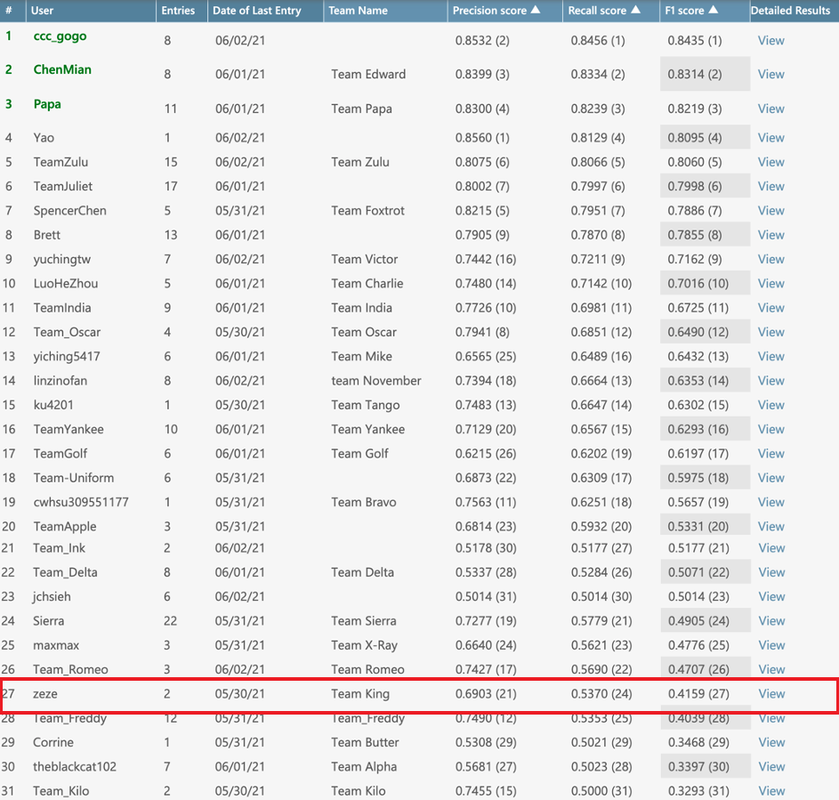

# Fake-EmoReact
* [site](https://competitions.codalab.org/competitions/31180?secret_key=2f97f399-8bba-4ed5-a0b7-99e17df1fe1b)

## Implement
* Use Bert to get the input text, reply, categories, and then fine tune and train the classifier.
* [Report](report/NLP_Final.pdf)
* [Implementation](report/final.ipynb)

## First Phase Result

## Evaluation Phase Result

